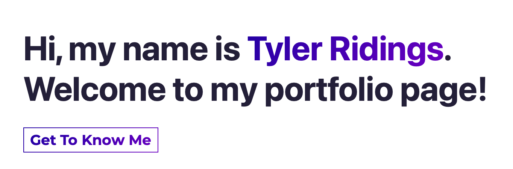

<!-- PROJECT SHIELDS -->

[![Contributors][contributors-shield]][contributors-url]
[![Forks][forks-shield]][forks-url]
[![Stargazers][stars-shield]][stars-url]
[![Issues][issues-shield]][issues-url]
[![MIT License][license-shield]][license-url]
[![LinkedIn][linkedin-shield]][linkedin-url]

<!-- PROJECT LOGO -->
<br />
<p align="center">
  <a href="https://github.com/SciFiTy10/portfolio">
    
  </a>

  <h3 align="center">My Portfolio</h3>

  <p align="center">
    A website I built to house all my projects and books
    <br />
    <a href="https://github.com/SciFiTy10/portfolio"><strong>Explore the docs »</strong></a>
    <br />
    <br />
    <a href="https://www.tylerridings.dev">View Demo</a>
    ·
    <a href="https://github.com/SciFiTy10/portfolio/issues">Report Bug</a>
    ·
    <a href="https://github.com/SciFiTy10/portfolio/issues">Request Feature</a>
  </p>
</p>

<!-- TABLE OF CONTENTS -->
<details open="open">
  <summary>Table of Contents</summary>
  <ol>
    <li>
      <a href="#about-the-project">About The Project</a>
      <ul>
        <li><a href="#built-with">Built With</a></li>
        <li><a href="#cicd-and-hosting">CI/CD and Hosting</a></li>
        <li><a href="#state-management">State Management</a></li>
        <li><a href="#project-folder-structure">Project Folder Structure</a></li>
        <li><a href="#things-i-learned-and-things-i-wouldve-done-differently">Things I Learned and Things I Would've Done Differently</a></li>
      </ul>
    </li>
    <li>
      <a href="#getting-started">Getting Started</a>
      <ul>
        <li><a href="#prerequisites">Prerequisites</a></li>
        <li><a href="#installation">Installation</a></li>
        <li><a href="#running-project">Running Project</a></li>
      </ul>
    </li>
    <li><a href="#usage">Usage</a></li>
    <li><a href="#roadmap">Roadmap</a></li>
    <li><a href="#contributing">Contributing</a></li>
    <li><a href="#license">License</a></li>
    <li><a href="#contact">Contact</a></li>
    <li><a href="#acknowledgements">Acknowledgements</a></li>
  </ol>
</details>

<!-- ABOUT THE PROJECT -->

## About The Project

<!--add link to main page -->


Welcome to my portfolio site!

This is a project I built to showcase my skills, all of my programming projects, and the book that I wrote.

---

### Built With

- [React](https://reactjs.org)
- [GatsbyJs](https://www.gatsbyjs.com)
- [GraphQL](https://graphql.org)
- [SCSS](https://sass-lang.com)
- [React Scroll](https://www.npmjs.com/package/react-scroll)

---

### CI/CD and Hosting

- [Gatsby Cloud](https://www.gatsbyjs.com/products/cloud/) - for builds, deployments, and hosting of the project

---

### State Management

Application State is kept within a local data.js file and is distributed to child components via the [React Context API](https://reactjs.org/docs/context.html).

Site metadata is retrieved using [GraphQL](https://graphql.org)

---

### Project Folder Structure

This project is organized by the job to be done for each file.

- There is a components folder, which breaks down further into Image components, Layout components, and then specific custom components.

- A context folder establishes the React Context object, Provider, and Consumer which will distribute data to our app's components.

- Data is for the application is stored within the Data folder.

- Pages holds the main page, as well as a custom error page.

- And finally we have a styles folder, which houses our SCSS modules. That folder contains styling which is applied by component, styling which is shared across components, and UI component styling.

---

### Things I Learned and Things I Would've Done Differently

- I found Gatsby to be both easy and hard to work with. If you know React well, this gives you a great starting point for a static site. But if you aren't as sharp with GraphQL, there is definitely a learning curve.

  **Reason** - This was some of my first exposure to GraphQL, and while the syntax for that wasn't that difficult to comprehend, what made things harder was the documentation for images in Gatsby.

  **Problems** - Per the documentation, there was a former gatsby-image plugin that's now deprecated. This is in favor of that plugin being replaced by a StaticImage and GatsbyImage (not sure why they couldn't pick a different name) plugin.

  I knew that I wanted a dynamic image, but couldn't for the life of me get the selected image to process via gatsbyImageData. I ended up having to use a StaticImage, and then handling the styling around it via media queries and additional style rules.

  **What would I change** - Maybe if I had more GraphQL experience this would have clicked for me, but I was a bit disappointed that to take advantage of this benefit of Gatsby, where image optimization is supposed to be a breeze, I had to overcome the hurdle of understanding GraphQL.

  I understand the strengths of GraphQL and what it brings to the table, but I'm not sure I understand why that had to be a requirement to obtain great image optimization.

<!-- GETTING STARTED -->

## Getting Started

To get a local copy up and running follow these simple steps.

### Prerequisites

Make sure you have the latest version of npm installed

- npm
  ```sh
  npm install npm@latest -g
  ```

---

### Installation

1. Clone the repo
   ```sh
   git clone https://github.com/SciFiTy10/burger-restaurant.git
   ```
2. Install NPM packages
   ```sh
   npm install
   ```

---

### Running Project

1. Running the project in development mode

   ```sh
   gatsby develop
   ```

   Then open https://localhost:8000 in your browser.

   Alternatively, to open in your default browser you can do

   ```sh
   gatsby develop --open
   ```

<!-- ROADMAP -->

## Roadmap

See the [open issues](https://github.com/SciFiTy10/burger-restaurant/issues) for a list of proposed features (and known issues).

<!-- CONTRIBUTING -->

## Contributing

Contributions are what make the open source community such an amazing place to learn, inspire, and create. Any contributions you make are **greatly appreciated**.

1. Fork the Project
2. Create your Feature Branch (`git checkout -b feature/AmazingFeature`)
3. Commit your Changes (`git commit -m 'Add some AmazingFeature'`)
4. Push to the Branch (`git push origin feature/AmazingFeature`)
5. Open a Pull Request

<!-- LICENSE -->

## License

Distributed under the MIT License. See `LICENSE` for more information.

<!-- CONTACT -->

## Contact

Tyler Ridings - [LinkedIn](https://www.linkedin.com/in/tyler-ridings-24804585/)

Personal Portfolio - [https://www.tylerridings.dev](https://www.tylerridings.dev)

Project Link - [https://www.tylerridings.dev](https://www.tylerridings.dev)

<!-- MARKDOWN LINKS & IMAGES -->

[contributors-shield]: https://img.shields.io/github/contributors/SciFiTy10/portfolio.svg?style=for-the-badge
[contributors-url]: https://github.com/SciFiTy10/portfolio/graphs/contributors
[forks-shield]: https://img.shields.io/github/forks/SciFiTy10/portfolio.svg?style=for-the-badge
[forks-url]: https://github.com/SciFiTy10/portfolio/network/members
[stars-shield]: https://img.shields.io/github/stars/SciFiTy10/portfolio.svg?style=for-the-badge
[stars-url]: https://github.com/SciFiTy10/portfolio/stargazers
[issues-shield]: https://img.shields.io/github/issues/SciFiTy10/portfolio.svg?style=for-the-badge
[issues-url]: https://github.com/SciFiTy10/portfolio/issues
[license-shield]: https://img.shields.io/github/license/SciFiTy10/portfolio.svg?style=for-the-badge
[license-url]: https://github.com/SciFiTy10/portfolio/LICENSE.txt
[linkedin-shield]: https://img.shields.io/badge/-LinkedIn-black.svg?style=for-the-badge&logo=linkedin&colorB=555
[linkedin-url]: https://www.linkedin.com/in/tyler-ridings-24804585/
